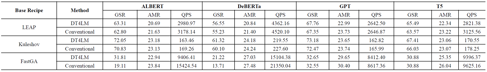
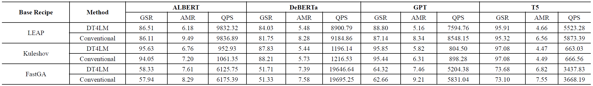
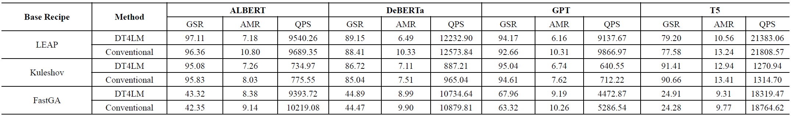

### RQ4: Dynamic Goal Function
<h3>Table: Ablation Study for Goal Function Design - SST2</h3>

<h3>Table: Ablation Study for Goal Function Design - RTE</h3>

<h3>Table: Ablation Study for Goal Function Design - MRPC</h3>
